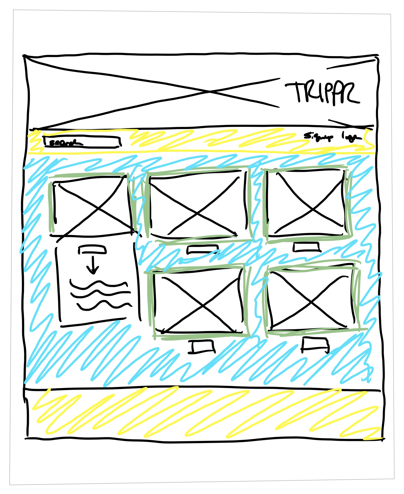

## About
Link to [Trippr](https://tripprga.herokuapp.com/)

We all agreed this site was similar to "Yelp", but we put our heads together and Trippr was born.  Trippr is a MEAN stack application about reading other people's stories and delving into their experiences at different locations.  Sure Yelp is out there, but this is like our own club.  We don't pay anyone to post reviews here.

----
## Approach Taken
1. Evaluate the strengths and weaknesses of the team members
2. Begin Agile approach by assigning backend and frontend files
3. Meet MVP as soon as possible.
3. Work on stretch goals
4. Test every day and debug.

----
## Technologies Used
* AngularJS
* Node.js
* Express
* Express-Session
* Mongoose
* Bcrypt
* HTML
* CSS
* GitHub
* Mongo Atlas
* Heroku
* Trello

----
## User Stories
* As a user, I can see the site - but have to join to post.
* As a user, I can create a login/password and know that they are encrypted and safe.
* As a user, I can post travel pictures and share must do's & don'ts.
* As a user, I can search the posts by keyword.
* As a user, I can "like" posts.

----
## Wireframe

----
## Resources

 *	[Skeleton Framework](https://getskeleton.com)
 * Ionicons (https://ionicons.com/) (magnifying glass & stick pin icons)
 * Google Fonts (https://fonts.google.com/)
 * Adobe InDesign (to create color palette from the header image)
 * Adobe Color (https://color.adobe.com/create) (to manipulate the color palette)

----
## Problems/Things to work on
* *GitHub*
  * Mainly in the first push to master so we can verify deployment.  Somewhere along the way we pushed and pulled to incorrect branches and we just could not get back to where we were.  We had a copy saved elsewhere so after deleting branches, we started over and breezed through the beginning stage of delegating tasks.

* *Routing Stretch Goal*
  * Another area was a stretch goal of using the routing capabilities of AngularJS using the ng-Route dependancy.  We actually had 90% completion until we realized that we would have to make some big changes to the public folder and with the deadline approaching, we replaced that goal with polishing the working app we had.
  
* *Moment.js Stretch Goal*
  * Added timestamps and tried for many hours to get Moment.js to convert them. But even with Dan's help, I wasn't able to get there. The best I got was getting the "createdAt" time (created by the timestamp) to appear on the page...but as we know, that's not very human friendly.

----
## :star2: The Trippr Team
* Tania Dodson (github)
* Mason A. Davis (Trello)
* Clayton O'Neill (Mongo Atlas)
* Jesus Vasquez (Heroku)
